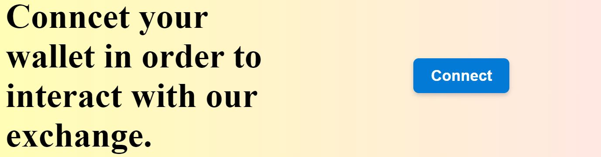

# Hardhat-Frontend
This is a simple blockchain web app called Your Brand


# Requirements

- [Metamask](https://metamask.io/)

> **PLEASE USE A METAMASK ACCOUNT THAT DOESN  NOT HAVE REAL MONEY.**

- [Yarn](https://classic.yarnpkg.com/lang/en/docs/install/) 

# Quickstart

1. Clone the repo

```
git clone https://github.com/ace-brown/hardhat-fundme
cd hardhat-frontend
```

2. Run the file.

You can just double click the file to "run it in the browser". Or you can right click the file in your VSCode and run "open with live server".

Optionally:

If you don't have a way to run your file in the browser, run:
```
yarn
yarn http-server
```

And you should see a small button that says "connect".



Hit it, and metamask pop up.
> **PLEASE USE A METAMASK ACCOUNT THAT DOESN  NOT HAVE REAL MONEY.**

# Execute a transaction

If you want to make a transaction follow this:

Make sure you have the following installed:

1. You'll need to open up a second terminal and run:

```
git clone https://github.com/ace-brown/hardhat-fundme
cd hardhat-fundme
yarn
yarn hardhat node
```

This will deploy a sample contract and start a local hardhat blockchain.

2. Update your `constants.js` with the new contract address.

In your `constants.js` file, update the variable `contractAddress` with the address of the deployed "FundMe" contract. You'll see it near the top of the hardhat output.

3. Connect your [metamask](https://metamask.io/) to your local hardhat blockchain.

> **PLEASE USE A METAMASK ACCOUNT THAT DOESN  NOT HAVE REAL MONEY.**
> you can use a few different browser profiles to separate your metamasks.

In the output of the above command, take one of the private key accounts and [import it into your metamask.](https://metamask.zendesk.com/hc/en-us/articles/360015489331-How-to-import-an-Account)

Additionally, add your localhost with chainid 31337 to your metamask.

5. Reserve the front end with `yarn http-server`, input an amount in the text box, and hit `fund` button after connecting

# Thank you for your time and attention!


